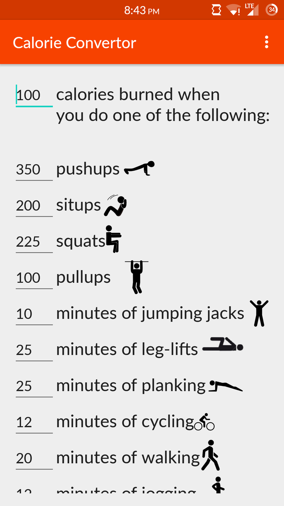
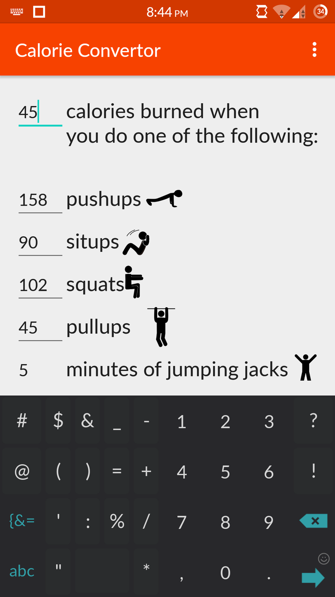
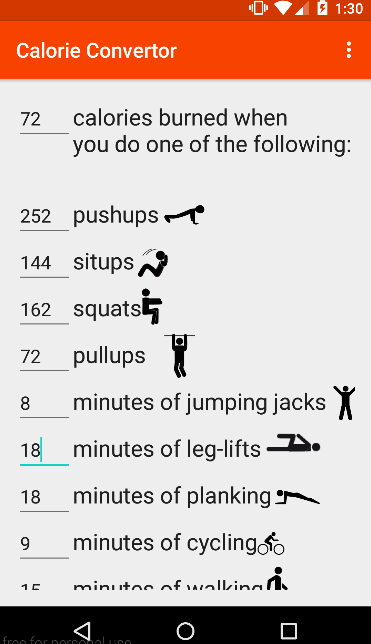
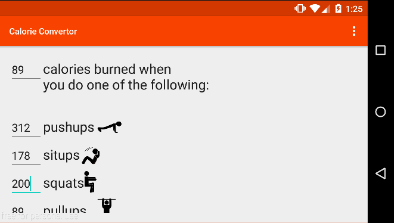
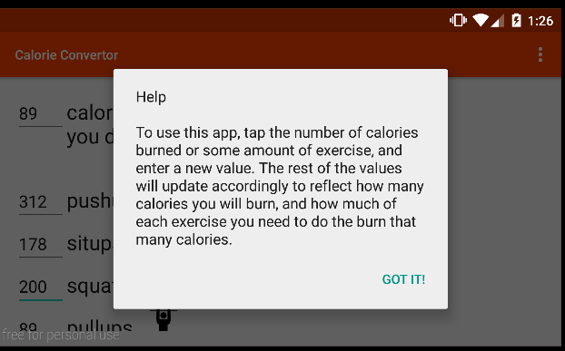

# PROG 01: Crunch Time

Calorie converter is a simple fitness helper app. At the top there is a number of calories, and following that, a list of many exercises. You’ll notice there are many numbers on the side that are underlined. All of these numbers are text fields, and if we tap on any of them and then change their numbers, then all the other values will be dynamically updated. The app starts with the “number of calories” field already selected, so the user will know that they can make changes to these fields. 

## Authors

Jasper Louie ([jasper.louie@berkeley.edu](mailto:jasper.louie@berkeley.edu))

## Demo Video

See Calorie Converter for CS160 Prog1  (https://youtu.be/MkrhbIuL-3o)

## Screenshots

## Acknowledgments

Icons used from the noun project, on thenounproject.com